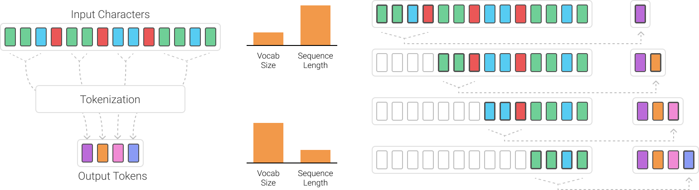

# byteBuddy — Lightweight Tokenization Models

byteBuddy is a compact collection of tokenizer models designed for efficient and flexible text preprocessing in modern natural language processing pipelines. It focuses on providing both standard subword tokenization and extended byte-level support, enabling robust handling of a wide variety of text inputs. These models are particularly useful for training and experimenting with transformer-based architectures, where tokenization quality directly impacts model performance.

The project is intended for developers and researchers who want a minimal yet practical setup for understanding how tokenizers work under the hood. By exposing both vocabulary files and trained models, byteBuddy makes it easy to inspect token distributions, debug encoding behavior, and integrate tokenization into custom machine learning workflows.



## Files Overview

### `t1k_bfF.model`

This is a binary tokenizer model file that stores the learned tokenization rules. It is not human-readable and is meant to be consumed programmatically through libraries such as SentencePiece. The model encodes how raw text should be split into subword units based on patterns learned during training. It is optimized for relatively clean and structured text, where the distribution of words is consistent and predictable.

### `t1k_bfF.vocab`

This file contains the vocabulary corresponding to `t1k_bfF.model`. Each entry maps a token to a score, which typically reflects its frequency or likelihood in the training corpus. The tokens are primarily subword units, including common prefixes, suffixes, and whole words. Special markers such as the leading underscore (`▁`) indicate whitespace boundaries, allowing the tokenizer to reconstruct original text spacing during decoding.

### `t1k_bfT.model`

This is another binary tokenizer model file, similar in structure to `t1k_bfF.model`, but trained with a broader token space. It cannot be decoded using standard text encodings such as UTF-8, which is expected behavior for serialized model data. This model is designed to support more diverse and potentially noisy input data by incorporating additional tokenization strategies.

### `t1k_bfT.vocab`

The vocabulary file for `t1k_bfT.model` extends beyond standard subword tokens by including the full range of byte-level tokens. Specifically, it contains entries for every possible byte value from `0x00` to `0xFF`. This ensures that any input string, regardless of encoding or content, can be tokenized without producing unknown tokens. In addition to byte tokens, the vocabulary still retains common subword units, allowing it to balance efficiency with robustness.

## Key Differences

| Feature             | `t1k_bfF`      | `t1k_bfT`                |
| ------------------- | -------------- | ------------------------ |
| Tokenization Type   | Subword        | Subword + Byte-level     |
| Robustness          | Moderate       | High                     |
| Vocabulary Coverage | Limited        | Full byte coverage       |
| Best Use Case       | Clean datasets | Noisy or arbitrary input |

The primary distinction between the two models lies in how they handle unseen or irregular text. While `t1k_bfF` performs well on structured datasets, `t1k_bfT` is more resilient in real-world scenarios where inputs may include unexpected characters, mixed encodings, or non-linguistic data.

## Byte Pair Encoding (BPE) — Theory

Byte Pair Encoding is a widely used subword tokenization technique that strikes a balance between character-level and word-level representations. Instead of relying on a fixed vocabulary of full words, BPE builds its vocabulary dynamically by learning frequently occurring patterns in the training data. This allows it to efficiently represent both common and rare words without excessively increasing vocabulary size.

At a high level, BPE begins with a vocabulary consisting of individual characters. It then repeatedly identifies the most frequent pair of adjacent symbols in the dataset and merges them into a new token. Over time, this process builds a hierarchy of subword units that capture meaningful linguistic patterns such as prefixes, suffixes, and common word fragments.

### How It Works

The algorithm starts by splitting all text into individual characters. For example:

```python
l o w
l o w e r
n e w e s t
```

It then counts the frequency of adjacent symbol pairs across the dataset. The most frequent pair is merged into a new token, and the dataset is updated accordingly. This process is repeated iteratively, each time merging the most common pair, until a predefined vocabulary size is reached.

As merges accumulate, the tokenizer begins to represent longer and more meaningful units:

```python
lo w
low
low er
new est
```

This iterative merging process allows BPE to adapt to the statistical structure of the training corpus, resulting in a compact and expressive vocabulary.

### Why BPE Is Effective

BPE is effective because it reduces the complexity of representing text while preserving important linguistic structure. It avoids the inefficiencies of character-level models, which require long sequences, and the limitations of word-level models, which struggle with rare or unseen words. By decomposing words into subword units, BPE enables models to generalize better and handle a wider range of inputs.

### Byte-Level Extension

The `t1k_bfT` tokenizer builds on the principles of BPE by incorporating byte-level tokens into the vocabulary. This means that every possible byte value is explicitly represented, ensuring that any input string can be tokenized without loss of information. This approach is particularly useful for handling inputs that include special characters, binary data, or text from multiple languages.

By combining subword tokenization with byte-level coverage, the model achieves both efficiency and robustness. Common patterns are still captured as subword units, while rare or unknown sequences fall back to byte-level representations. This hybrid approach is widely used in modern language models to ensure consistent behavior across diverse datasets.

## Usage

These tokenizer models can be used with libraries such as SentencePiece, which provide efficient implementations for encoding and decoding text.

```python
import sentencepiece as spm

sp = spm.SentencePieceProcessor()
sp.load("t1k_bfF.model")  # or "t1k_bfT.model"

tokens = sp.encode("To be, or not to be", out_type=int)
text = sp.decode(tokens)

print(tokens)
print(text)
```

## Choosing the Right Model

The `t1k_bfF` model is suitable for scenarios where the input data is clean, well-structured, and consistent with the training distribution. It offers a smaller vocabulary and faster processing, making it efficient for controlled environments.

The `t1k_bfT` model is better suited for real-world applications where input data may be noisy, unpredictable, or contain a wide range of characters. Its byte-level fallback mechanism ensures that no input is rejected or misrepresented, making it a more robust choice for production systems.

## Notes

The `.model` files are binary artifacts that should only be accessed through appropriate libraries. Attempting to open them directly as text will result in decoding errors. The `.vocab` files, on the other hand, are human-readable and can be used to inspect the structure and composition of the tokenizer.

Tokens prefixed with the underscore character (`▁`) indicate the beginning of a word or a whitespace boundary. This convention allows the tokenizer to preserve spacing information without explicitly storing spaces as separate tokens.

## Use Cases

byteBuddy can be used in a variety of applications, including training language models, preprocessing text for machine learning pipelines, and experimenting with different tokenization strategies. It is particularly useful for understanding how tokenization impacts downstream model performance and for building custom NLP systems from scratch.

## Future Improvements

Planned extensions for this project include conversion utilities for integrating with Hugging Face tokenizers, scripts for training new tokenizers on custom datasets, and tools for visualizing token distributions and merge operations. Additional benchmarking against standard datasets may also be included to evaluate performance across different tasks.
